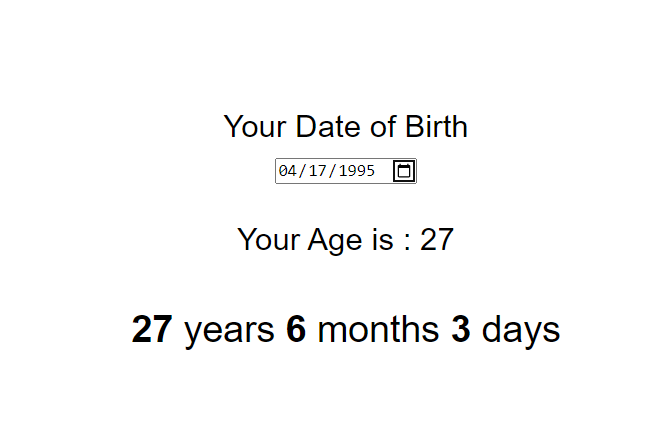

# Age-Calculator - 45mins

### Time - 45mins (including research and building logic)

### Major Learnings

- **Targeting** elements and saving it into seperate variable
- **Working** with Date constructor
- **Calculating** month and days difference from given input date 

> [Github Link](https://github.com/abhishek7329sharma/Age-Calculator)

> [Live Link](https://timely-dolphin-e65dc5.netlify.app)